# Sweet Shop Management System

A modern, full-stack sweet shop application built with the MERN stack. This project implements a complete e-commerce solution for a sweet shop with user authentication, shopping cart functionality, image uploads, and admin management features.

## 🚀 Features

### 🔐 Authentication & Authorization
- **User Registration**: Choose between regular user or admin account during signup
- **JWT Authentication**: Secure login/logout with token-based auth
- **Role-based Access**: Different features for users and admins

### 🛒 Shopping Experience
- **Browse Sweets**: Beautiful grid layout with sweet categories and pricing
- **Real-time Search**: Instant search functionality with live results
- **Shopping Cart**: Add items, manage quantities, persistent cart storage
- **Order Management**: Place orders, view order history with detailed breakdowns
- **Stock Validation**: Prevents ordering more than available stock
- **Image Gallery**: View actual product images with fallback emojis

### 👑 Admin Features
- **Inventory Management**: Add, edit, delete sweets from inventory
- **Image Upload**: Upload product images with drag & drop functionality
- **Stock Control**: Restock items and monitor inventory levels
- **Order Oversight**: View and manage all customer orders
- **Dashboard Analytics**: Track inventory stats and low stock alerts

### 🎨 Modern UI/UX
- **Responsive Design**: Works seamlessly on desktop, tablet, and mobile
- **Beautiful Components**: Custom-built UI components with Tailwind CSS
- **Smooth Animations**: Hover effects, transitions, and loading states
- **Toast Notifications**: Real-time feedback for user actions
- **Image Upload**: Drag & drop interface with preview functionality

## 📸 Screenshots

### 🏠 User Experience

#### Registration & Authentication
<div align="center">
  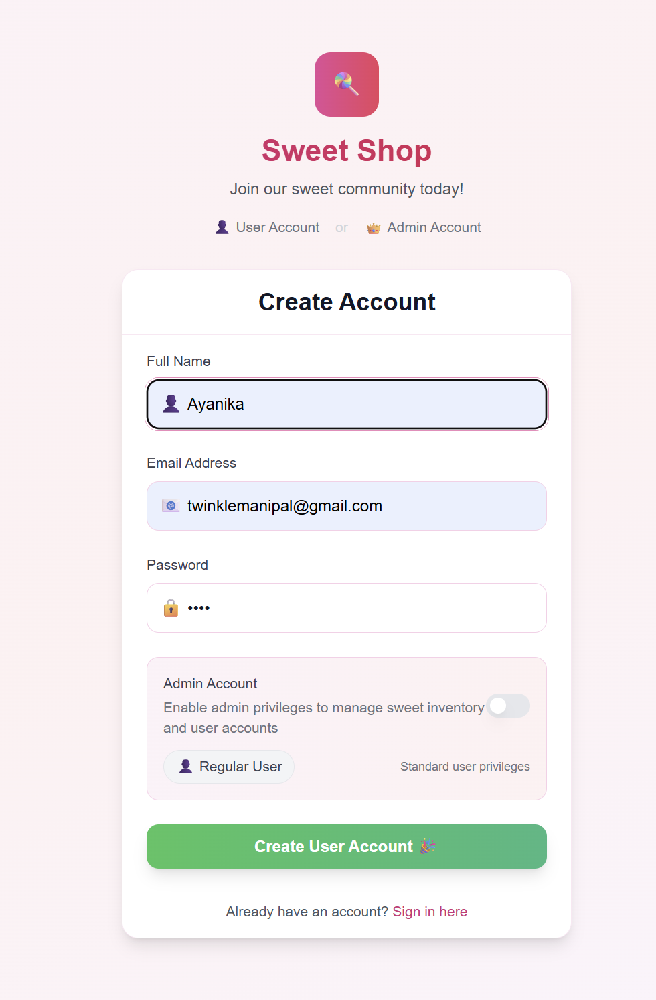
  
</div>
<p align="center"><em>User registration with admin role selection & secure login interface</em></p>

#### Sweet Shop Dashboard
<div align="center">
  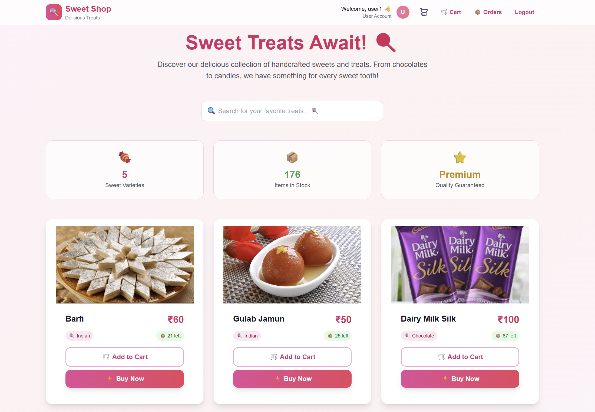
</div>
<p align="center"><em>Beautiful hero section with search functionality and stats overview</em></p>

<div align="center">
  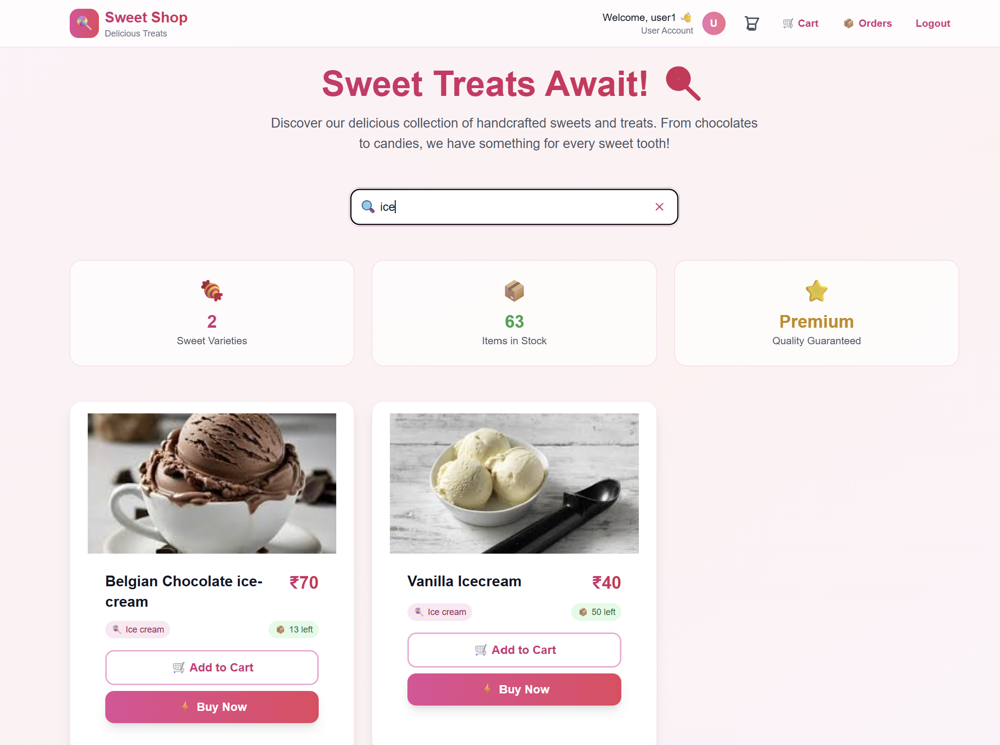
</div>
<p align="center"><em>Product grid with real images, categories, and pricing</em></p>

#### Shopping Cart & Orders
<div align="center">
  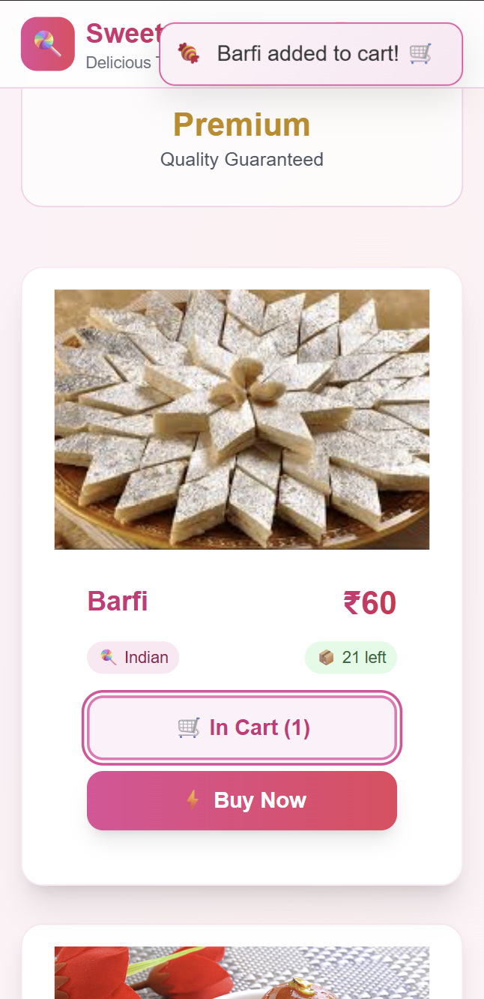
  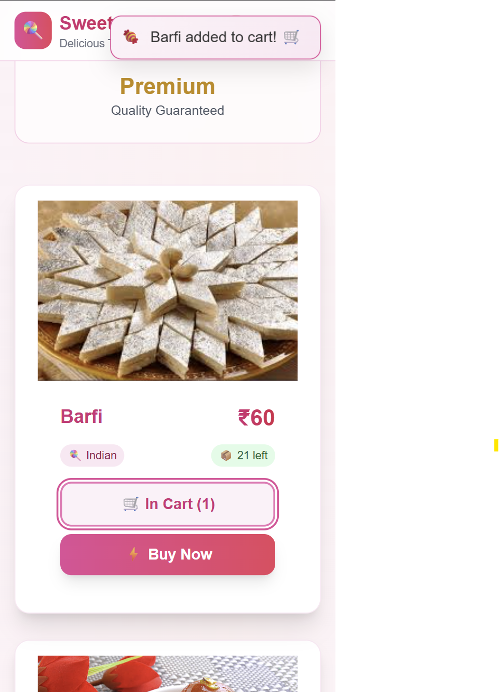
</div>
<p align="center"><em>Cart sidebar for quick access & detailed cart page with order summary</em></p>

<div align="center">
  
</div>
<p align="center"><em>Comprehensive order history with detailed breakdowns</em></p>

### 👑 Admin Experience

#### Admin Dashboard
<div align="center">
  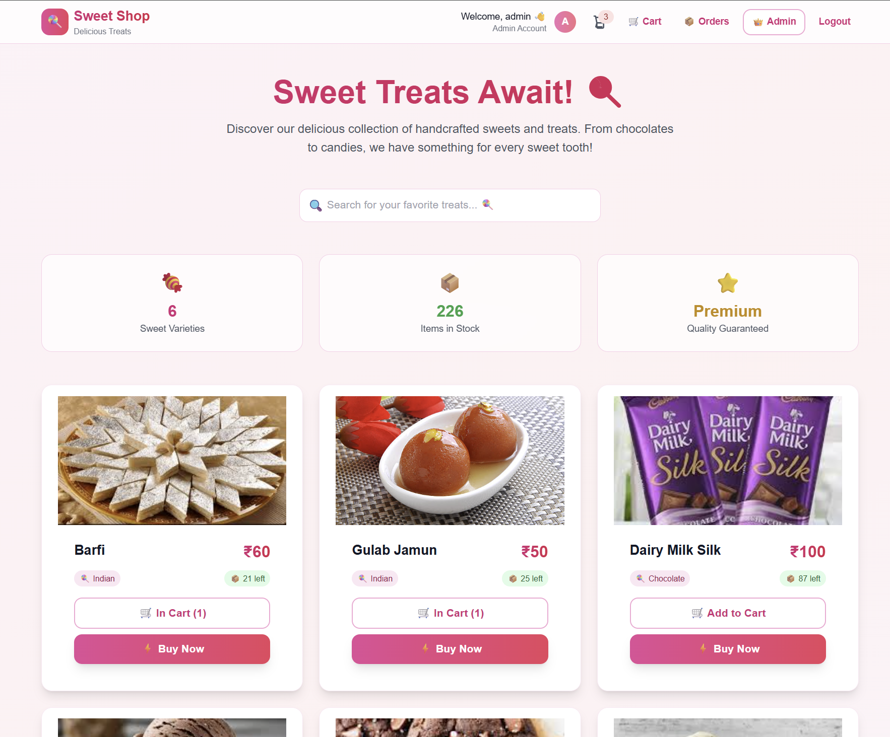
</div>
<p align="center"><em>Admin dashboard with inventory stats and management tools</em></p>

#### Product Management
<div align="center">
  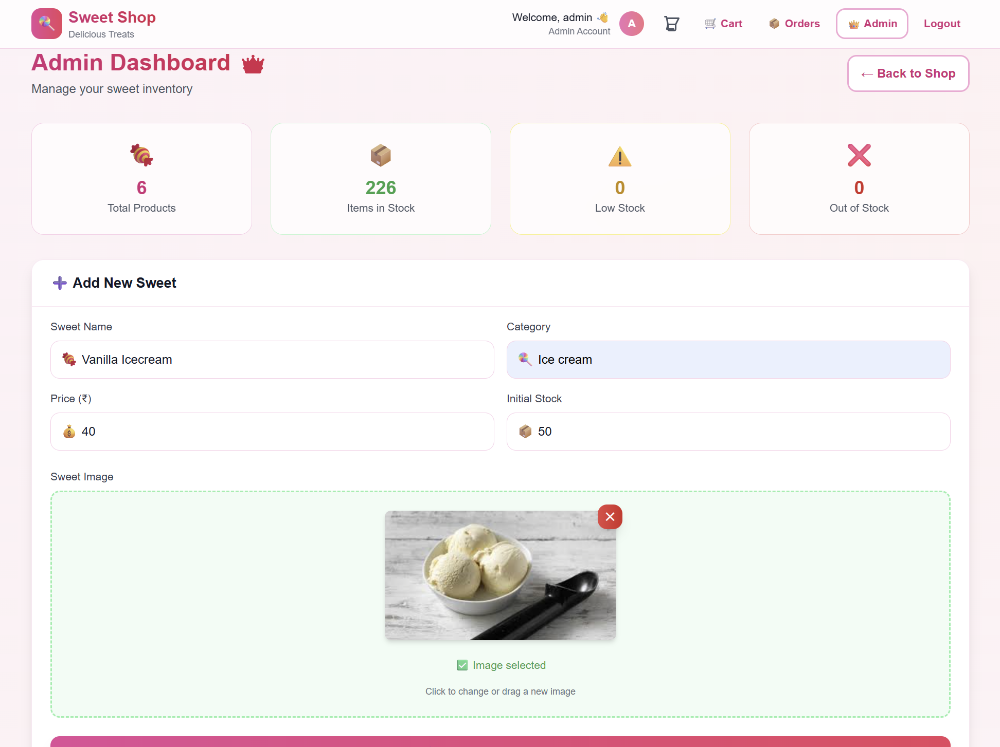
</div>
<p align="center"><em>Add new products with comprehensive form interface</em></p>

#### Inventory Management
<div align="center">
  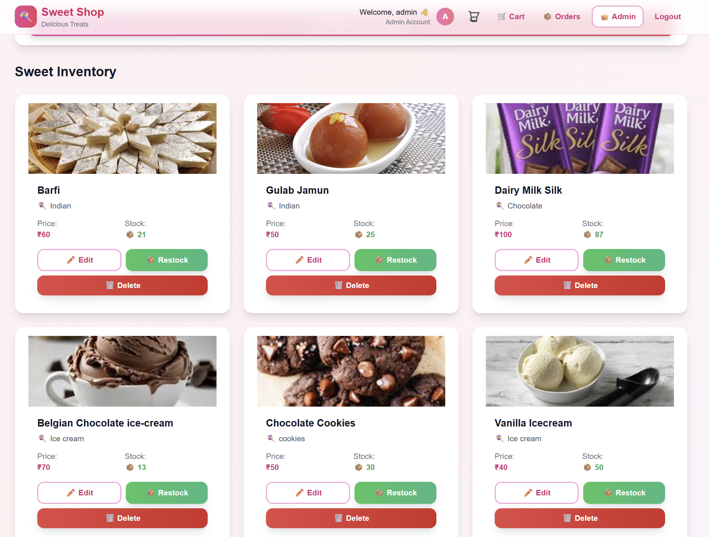
</div>
<p align="center"><em>Inventory management with stock status indicators and quick actions</em></p>

### 📱 Responsive Design
<div align="center">
  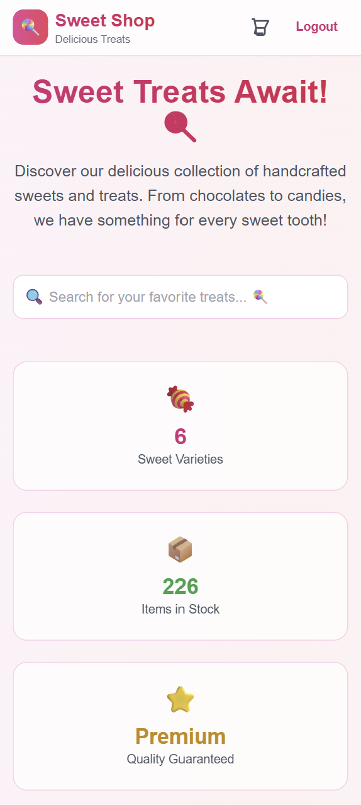
  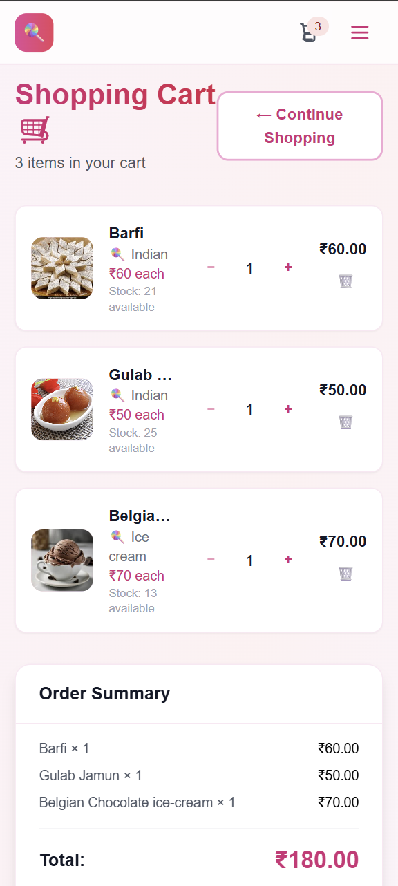
  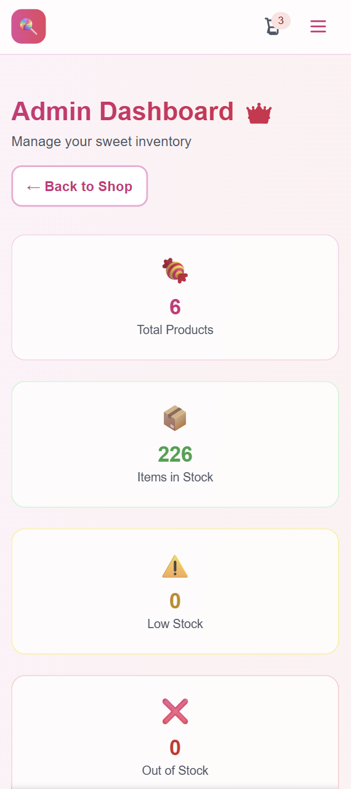
</div>
<p align="center"><em>Fully responsive design across all devices</em></p>


## 🛠️ Tech Stack

**Frontend:**
- React 19 with modern hooks
- Tailwind CSS for styling
- React Router for navigation
- Axios for API calls
- React Hot Toast for notifications

**Backend:**
- Node.js & Express.js
- MongoDB with Mongoose
- JWT for authentication
- bcrypt for password hashing
- Multer for file uploads
- CORS for cross-origin requests

**Development:**
- Vite for fast development
- Nodemon for auto-restart
- ESLint for code quality
```

## 🚀 Getting Started

### Prerequisites
- Node.js (v18 or higher)
- MongoDB (local or Atlas)
- Git

### Installation

1. **Clone the repository**
```bash
git clone https://github.com/Ayanika0812/incubyte-assignment-sweet-shop.git
cd sweet-shop
```

2. **Backend Setup**
```bash
cd backend
npm install
```

Create a `.env` file in the backend directory:
```env
MONGO_URI=mongodb://localhost:27017/sweetshop
JWT_SECRET=your_jwt_secret_key
PORT=5000
NODE_ENV=development
```

Start the backend server:
```bash
npm run dev
```

3. **Frontend Setup**
```bash
cd ../frontend
npm install
npm run dev
```

The application will be available at:
- Frontend: http://localhost:5173
- Backend API: http://localhost:5000

## 🧪 Testing

Run the test suite:
```bash
cd backend
npm test
```

Tests cover:
- Authentication endpoints
- Sweet CRUD operations
- Order management
- Middleware functionality

## 📱 Usage

### For Users:
1. Register for an account (choose user or admin role)
2. Browse the sweet collection with images
3. Add items to your cart
4. Place orders and track order history

### For Admins:
1. Access the admin panel from the header
2. Add new sweets with image uploads
3. Edit existing sweets and update images
4. Manage stock levels and restock items
5. View and manage customer orders

## 🔧 API Endpoints

### Authentication
- `POST /api/auth/register` - User registration
- `POST /api/auth/login` - User login

### Sweets
- `GET /api/sweets` - Get all sweets
- `GET /api/sweets/search` - Search sweets
- `POST /api/sweets` - Add sweet with image (Admin)
- `PUT /api/sweets/:id` - Update sweet with image (Admin)
- `DELETE /api/sweets/:id` - Delete sweet (Admin)
- `POST /api/sweets/:id/purchase` - Purchase sweet
- `POST /api/sweets/:id/restock` - Restock sweet (Admin)

### Orders
- `POST /api/orders` - Create order
- `GET /api/orders/my-orders` - Get user orders
- `GET /api/orders/:id` - Get order by ID
- `GET /api/orders/admin/all` - Get all orders (Admin)

## 🎨 Component Architecture

The frontend uses a modular component architecture:

- **UI Components**: Reusable components (Button, Input, Card, Toggle, ImageUpload, etc.)
- **Layout Components**: Header, Footer, Layout wrapper
- **Feature Components**: Sweet cards, cart items, admin forms
- **Pages**: Complete page components with business logic

## 🔒 Security Features

- JWT token authentication
- Password hashing with bcrypt
- Role-based access control
- Input validation and sanitization
- File upload validation (type, size)
- CORS configuration
- Protected API routes

## 🤖 AI Development Reflection

### Tools & Technologies Used
- **ChatGPT** - Feature planning and problem-solving consultation

### Development Impact & Workflow

AI tools significantly enhanced the development process, contributing approximately **35-45%** efficiency gains across different phases:

**⚡ Code Generation (60% AI-assisted)**
- Boilerplate code for MERN stack setup
- React component scaffolding with modern hooks
- Express.js route handlers and middleware
- MongoDB model definitions and validation schemas
- Tailwind CSS responsive design classes
- File upload implementation with Multer

**🎨 UI/UX Development (30% AI-assisted)**
- Component design patterns and reusability
- Responsive layout implementation
- Animation and transition effects
- User experience flow optimization
- Image upload interface with drag & drop

### Key Benefits Realized

1. **Faster Prototyping**: Rapid iteration on features and UI components
2. **Code Quality**: AI suggestions helped maintain consistent patterns and best practices
3. **Learning Acceleration**: Exposure to modern React patterns and advanced JavaScript concepts
4. **Focus Shift**: More time spent on business logic and user experience rather than syntax
5. **Error Prevention**: Proactive identification of potential issues and edge cases
6. **Feature Enhancement**: AI helped implement complex features like image uploads and cart management

### Manual Oversight & Quality Assurance

While AI tools provided substantial assistance, human oversight remained crucial for:
- **Business Logic Validation**: Ensuring features met actual requirements
- **Security Review**: Validating authentication flows and data protection
- **Performance Optimization**: Fine-tuning database queries and component rendering
- **User Experience Testing**: Real-world usability and accessibility testing
- **Code Integration**: Ensuring all AI-generated components worked cohesively
- **File Upload Security**: Implementing proper validation and error handling

### Reflection on AI-Human Collaboration

The development process demonstrated that AI tools excel at:
- Generating repetitive code structures
- Suggesting modern best practices
- Providing multiple solution approaches
- Accelerating initial setup and configuration
- Implementing complex features like file uploads

However, human expertise remained essential for:
- Strategic decision making
- Creative problem solving
- Quality assurance and testing
- Understanding user needs and business requirements
- Security considerations and edge case handling

This project showcases how AI can augment developer productivity while maintaining code quality and innovation through thoughtful human-AI collaboration.

## 🚀 Deployment

The application is ready for deployment on platforms like:
- **Frontend**: Vercel, Netlify, GitHub Pages
- **Backend**: Railway, Heroku, DigitalOcean
- **Database**: MongoDB Atlas (recommended)

## 🤝 Contributing

1. Fork the repository
2. Create a feature branch
3. Make your changes
4. Add tests if applicable
5. Submit a pull request

---

Built with ❤️ using the MERN stack and AI-assisted development